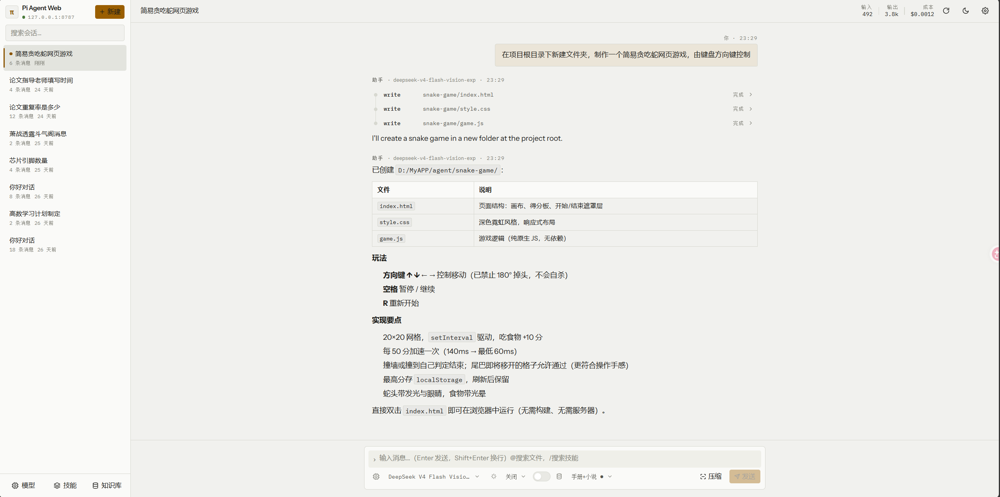
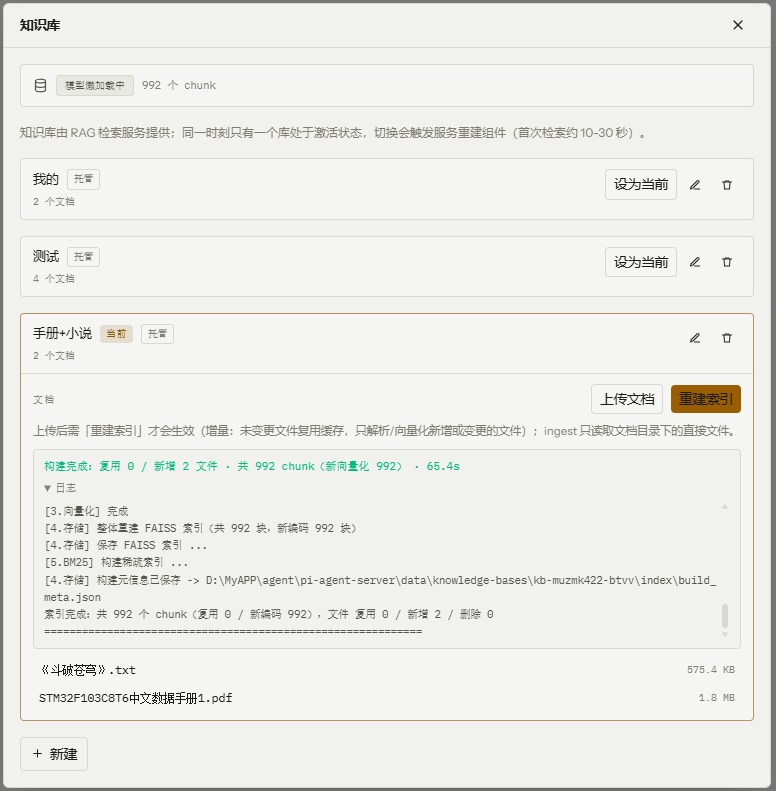
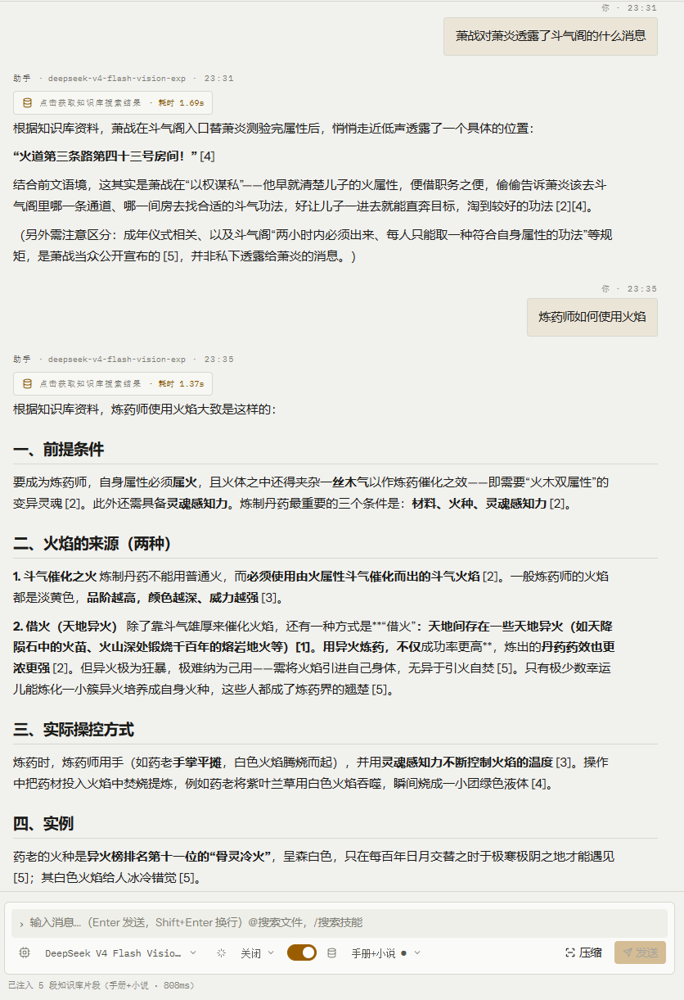
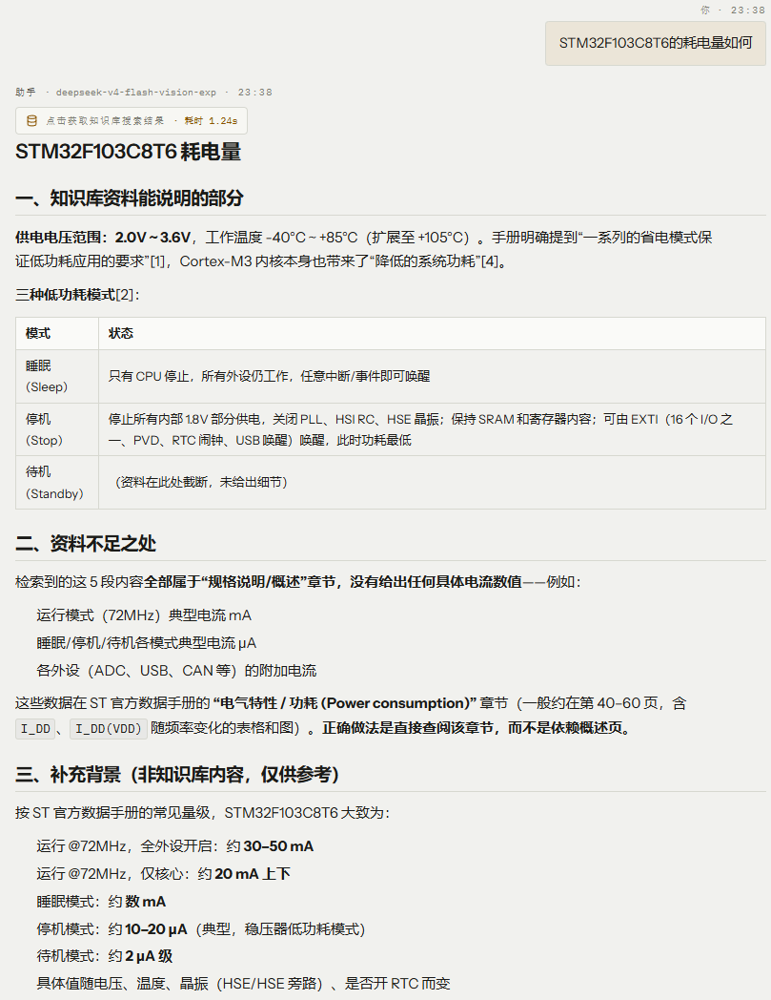
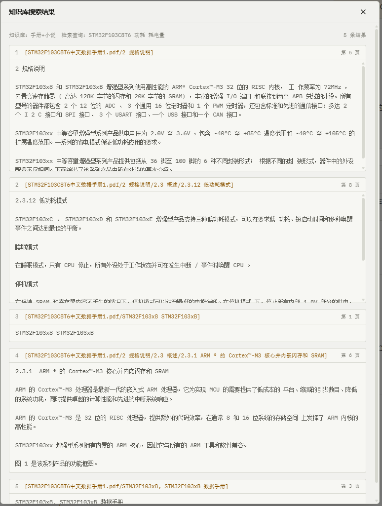

Pi Agent · 浏览器编码智能体工作台

本目录是一个**双应用工作区**：`pi-agent-server` 把 Pi（`pi-coding-agent`）以 **SDK 同进程嵌入**方式包装成 HTTP + SSE 服务；`pi-agent-web` 是纯浏览器前端，不依赖 Pi SDK，只消费服务端的 REST + SSE。另附一份 Pi 内嵌集成的调研报告，作为两个应用的技术选型依据。

## 基本功能展示：

**常规智能体功能**



**知识库检索功能**

| **<br />知识库设置** | **<br />知识库检索（小说内容)** |
| :----------------------------------------------------------: | :----------------------------------------------------------: |
| **<br />知识库检索（手册内容）** | **<br />检索内容原始详情查看** |


## 仓库构成

| 目录 / 文件          | 角色                     | 端口   | 说明                                                                 |
| -------------------- | ------------------------ | ------ | -------------------------------------------------------------------- |
| `pi-agent-server/`   | 后端（Node + TypeScript）| `8787` | 内嵌 Pi SDK 的编码智能体服务：多会话、SSE、模型/供应商热切换、RAG    |
| `pi-agent-web/`      | 前端（Vite + React 19）  | `5173` | 浏览器界面：对话、工具调用可视化、供应商/技能/知识库管理             |
| `pi-embedding-report.md` | 调研报告（只读）     | —      | Pi 项目分析与内嵌集成的四条路线对比，本项目采用**路线 A（SDK 同进程）** |
| `AGENTS.md`          | 协作说明                 | —      | 给 AI 协作者的仓库说明（各子目录另有自己的 `AGENTS.md`）             |

## 架构

```
浏览器（pi-agent-web :5173，Vite dev）
  │   /api/*（dev 代理，SSE 逐 prompt 流式）        │  生产：静态 dist/ + 反代 /api
  ▼
pi-agent-server :8787（Node 原生 http + 手写 SSE，零 Web 框架）
  └─ Pi SDK（createAgentSession / ModelRuntime / SessionManager）
       ├─ 会话 JSONL      data/sessions/*.jsonl
       ├─ 供应商 / Key    config/providers.json（热重载）
       ├─ 工作区工具      workspaceDir = 本目录（..）
       └─ 知识库（可选）  data/knowledge-bases/ ──►  RAG 检索服务 :8100
```

- 前端与后端为**两个独立应用**，仅通过 HTTP API 耦合；后端 API 变更时需同步检查另一侧契约。
- 后端的 agent 工具作用域默认是本目录（`pi-agent-server/config/server.json` 的 `workspaceDir: ".."`），即 agent 可以直接读写两个应用的源码。
- 全部运行时状态隔离在 `pi-agent-server/data/`，不读写 `~/.pi/agent`。

## 环境准备

| 软件          | 要求                   | 说明                                                                 |
| ------------- | ---------------------- | -------------------------------------------------------------------- |
| Node.js       | >= 22（后端最低 18）   | 两个应用都用 npm 管理依赖                                            |
| 模型 API Key  | 至少一个可用供应商     | 填入 `pi-agent-server/config/providers.json`（如 DeepSeek）          |
| RAG 检索服务  | 可选                   | 仅知识库功能需要；默认指向 `D:\MyAPP\rag`（FastAPI `:8100`），可自动拉起 |

## 快速开始

启动顺序：**后端 → 前端**（前端所有数据都来自后端）。

### 1. 启动后端（端口 8787）

```bash
cd pi-agent-server
npm install                 # 仅首次
npm start                   # 或 npm run dev（watch 模式）
```

首次使用先在 `config/providers.json` 填入可用的 `apiKey`（文件格式见 `pi-agent-server/README.md`）。

### 2. 启动前端（端口 5173）

```bash
cd pi-agent-web
npm install                 # 仅首次
npm run dev                 # http://127.0.0.1:5173
```

Vite 已把 `/api` 代理到 `127.0.0.1:8787`，直接访问 `5173` 即可，无需打开后端端口。

## 目录结构

```
agent/
├── pi-agent-server/            # 后端：内嵌 Pi SDK 的 HTTP + SSE 服务
│   ├── config/                 # server.json（服务配置）、providers.json（供应商/Key）
│   ├── data/                   # 运行时数据（会话/凭据/知识库，gitignored）
│   ├── src/                    # server / agent-manager / knowledge / providers / skills / files / config
│   └── README.md               # 后端说明 + 完整 HTTP API
├── pi-agent-web/               # 前端：Vite + React 19 + Tailwind v4 单页应用
│   ├── src/                    # components / state / lib / i18n / hooks / styles
│   ├── dist/                   # 构建产物（npm run build）
│   └── README.md               # 前端说明 + 对接表 + 设计要点
├── pi-embedding-report.md      # Pi 内嵌集成调研报告（只读）
├── AGENTS.md                   # 仓库协作说明
└── README.md                   # 本文件
```

## 相关文档

- [pi-agent-server/README.md](pi-agent-server/README.md) — 后端：功能、配置项、HTTP API、SSE 事件流、调用示例
- [pi-agent-server/项目文档.md](pi-agent-server/项目文档.md) — 后端完整接口文档与更多调用示例
- [pi-agent-web/README.md](pi-agent-web/README.md) — 前端：功能、技术栈、对接表、设计说明、构建部署
- [pi-embedding-report.md](pi-embedding-report.md) — Pi 项目分析与内嵌集成的四条路线对比
- [pi-agent-server/AGENTS.md](pi-agent-server/AGENTS.md) / [pi-agent-web/AGENTS.md](pi-agent-web/AGENTS.md) — 各子项目的开发约定

## 注意事项

- **先读子项目说明再动手**：修改任一应用前，先看其 `AGENTS.md` 与 `README.md`；跨应用改动（如接口字段）需同时核对前后端契约。
- **Key 安全**：`pi-agent-server/config/providers.json` 含真实 API Key，仅供本地使用，勿外传、勿提交到公开仓库；接口响应已脱敏。
- **端口冲突**：`8787` 被占用说明已有旧的后端实例在跑，先结束监听进程；前端开发固定 `5173`（若本地另跑 pi-web 参考项目会占用 `30141`，注意区分）。
- **本目录不是 git 仓库**，两个应用各自独立；每个应用目录内的 `data/`、`node_modules/`、`dist/` 等均已 gitignore。
- **RAG 服务可选**：不启用知识库时可在 `pi-agent-server/config/server.json` 设 `rag.autoStart: false`，其余功能不受影响。
